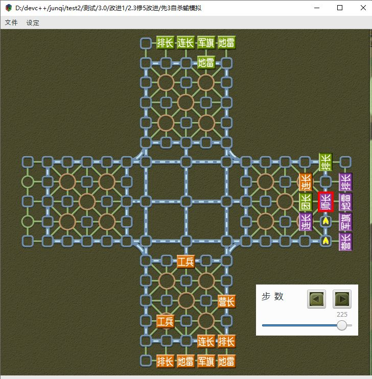
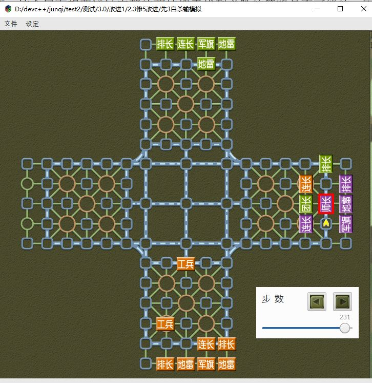

找个典型局面分析吧，这样一直拖延下去也不是办法。在这个局面下假定连长和营长都比较小，知道师长很大，营长和地雷都没碰过可以交换，按我的分析这个局面是可以必胜的，我分析时的思路绝不是搜索+剪枝，而是推演+一些简单的逻辑判断。这个局面想要通过完整的剪枝搜索找到必胜的策略是不可能的，因为至少10多个回合，需要搜30层甚至40层，棋盘又那么空旷，是不可能有电脑算的完的。那有没有可能假如完整的必胜策略要搜40层，我大范围先搜12层+后续的针对性搜索得出一个正确的着法，就是你搜完整了也是怎么下，我虽然没有搜到必胜，但最后必胜的着法在我的所有可选择的着法中打分是最高的？不太清楚，我已经完全放弃了剪枝算法，对这个不了解，从直觉上来说，我觉得剪枝算法在中盘阶段子力比较密集时搜的会比较精确，在残局时容易犯方向性错误，不知道高端的国际象棋软件如stockfish他们是怎么处理残局的？stockfish有中国象棋的移植版皮卡鱼。

最新中国象棋软件排名天梯图（2025年7月） - 墨刻书香的文章 <br>
https://zhuanlan.zhihu.com/p/686561868

我为什么放弃剪枝算法？因为我感觉这个算法前途不是很大，是那种有多少人工就有多少智能的算法，应用场景有限。把剪枝算法做到极致在军棋上有可能战胜人类吗？有一定可能，但可能和人类的下棋思路有较大的差异。

不说剪枝了，还是说说我自己的算法碰到的困难吧。我反思了下我的分析思路，对于那种需要考虑超长行棋序列的局面，我是通过一系列逻辑约束过渡到一个必然要出现的中间局面，再从这个中间局面重新开始搜索。比如下图中，把营长打掉是一个必然要出现的中间局面（需要打明地雷的位置）。如何以中间局面为单位元做后续的搜索和价值评估是个难点，思路是这样，但我不知道代码怎么设计。到了这个局面，按我的思路，需要把绿色底下的那个连长调到紫色军旗侧，因为排长需要牵制师长让它不能从51 53来回走，团长需要牵制师长不能把那个排长吃了。我当时为什么会这么想？这不需要绿色出子，橙色排长下去就直接结束了。既然这样就当橙色只剩一个工兵和三角雷，那就需要绿色出连长了。先不去深究这个局面了，我的困惑是对于大范围有针对性的子力调动，如何让ai像人类一样通过基础逻辑的判断来推演，而不是盲目的剪枝搜索，然后让高智商程序员做一系列精巧的优化。这样的ai只能应用在特定的领域，而不能广泛应用到其他领域，因为高智商的程序员并没有那么多，到最后ai竞赛还是停留在人力资源的竞赛，有多少人工就有多少智能，ai的价值无法体现出来。

在残局阶段，根据基础逻辑的判断来搜索，这种判断是精确的，而不是深度学习算法中的概率高。军棋也是一样的，想要通过基础逻辑的判断来搜索首先要构造范畴，没有范畴就会沦为暴力的剪枝搜索，人脑中有一套构造范畴的通用方法，很多人都没有意识到。

在深度学习算法中，自我对弈似乎仅仅只是反馈一个输赢用来调整权重。在我的算法构思中，自我对弈的棋谱是作为一种用来构造范畴的历史数据，范畴似乎不是固定的，范畴也像权重一样是不断动态调整的。大模型用无数人类语料和巨大的算力似乎近似模拟出了人类思维中的范畴，但人类思维中的范畴是可以做精确逻辑判断的。

大模型这种概率模型为什么会产生指令遵循呢？通过对立统一构造通用范畴这整个过程非常复杂。

你的心必须不动，所谓不动是心不留于事物，不因一见而止于心，譬如有十个人，每个人欲砍我一刀时，我每拒一刀时均不止于一刀，则拒一刀而自如，若是我心仅只于一人，则或可使拒掉一刀，则下一人之刀便来不及了，懂吧。

罗雨与霍永刚 - 动画片《封神榜传奇》主题曲
作词:郑方 作曲:袁怡珏
在那遥远的时空闪烁
是那神秘的古老传说
经过漫长的岁月蹉跎
依然留在我心中
他们是一群真的英雄
他们的故事惊心动魄
历尽了艰险百折千磨
惊涛骇浪都闯过
传说 传说在那变幻莫测的某个时空
传说 传说他们千变万化能各显神通
传说 传说任凭时光流转但正气不灭
给我们留下神的传说
传说 传说 传说
传说 传说任凭时光流转但正气不灭
给我们留下神的传说

每走一步棋都是有理由的，比如走闲逼迫对方改变位置，漫无目的也是一种理由。在空旷处子力调动大概率是没阻碍的，如果有需要给出特殊的理由，在密集处，子力的从一个位置移动到较远的另一个位置，大概率是有阻碍的，如果没有需要给出特殊的理由。所以在空旷处考虑一个子力移动到关键点位时就不要考虑线路了，如果有很多步时剪枝搜索在这里会产生大量重复的无意义搜索。而在密集处时，子力的移动要优先考虑是否存在线路，如果不考虑线路直接考虑把子力移动到其他位置的后续变化，可能会出现不符合客观现实的凭空幻想。判断空旷还是密集就需要用到统计学了，要特别关注那些判断错误的案例，比如把空旷当成密集，或者把密集当成空旷的，错误不要局限于定义，而要根据错判后对后续局面造成的恶劣影响来调整出一个比例值，像pid控制那样。

现在把紫色的营长和地雷换一下，团长从53下抗军旗，这个线路到53是第1步，到63是第2步。对于一个进攻的线路，第一步防守方必须要能1步到达，第2步防守方必须能2步到达，第3步防守方必须要3步到达，比如这个局面，团长到53时，师长必须要处在5线铁路的位置，能一步到达53才能防守住，你下来我就吃掉你，如果师长在外面需要多步才能回53救援，那么就防守不住。军棋中的铁路是可以移动多步的，所以挡在进攻的铁路线路上也能防守。把进攻线路称作A目标，把防守线路称作B目标，A目标和B目标是对立统一的。师长一直守着，B破环了A，团长无法完成进攻，如果工兵继续从51挖地雷同时进攻，记作线路C，那么C就破坏了“B破环了A”，B无法兼顾A和C，被双下了，如果师长在51和53来回移动就能同时守住线路A和线路C，这个时候当师长在51时再塞一个排长到52，就破坏了师长在51和53的来回移动。对立统一是质，线路中的步数计算是量，量变产生质变。

 <br>
 <br>

------
接下来打算讲讲那个基本流程，不开头总是没什么思路，开了头后写着写着就会有很多思路涌来。

pTrace = GenSendTrace(pJunqi,apSend);apSend返回为空，除了pTrace->bNeg将其设为NULL还有什么情况？因为apSend只能是走棋方的配对，之前轮询的所有棋子，所以挑选出来的可能是其他家的，如果src是其他家的，不能走棋，需要通过GenHomeNode重新遍历，最多5次，遍历前先把之前挑选出来的过滤掉。但是这代码很奇怪，SetFilterTraceNode不应该是放在GenHomeNode前面吗？之前配对的特征比较后都会放在pTrace里，不知道这里ClearTraceSet一下是什么意思，感觉逻辑不通，是不是和SetFilterTraceNode搞混了？如果src是其他家的，不能走棋，那不能直接在生成的时候就过滤吗？因为有时eTurn方行棋可能需要依赖其他家的，比如对家的棋被下家抓着，这属于高优先级，我方需要出子保护格挡之类的，就需要依赖这个pair。

我记得之前写过一个rollback的代码，不知道什么原因注释掉了，应该没删吧？找到了，pJunqi->move.iSeq应该是nRpOfst，之前应该是照抄EngineDupProcess。rollback这个代码是有用的，只是这个太宏大了，当时的开发距离这个还比较遥远，它的构思应该是这样的，比如下到100步，发现下错了，但是选择其他任何着法都是错的，在100步已经改不回来了，那就退回到98步看看能不能改回来，98步不行再退回到96步，下的时候肯定是不可能这么做的，因为不能悔棋，回滚是复盘训练的时候用来修复各种权重参数的。回滚的逻辑不是很难，难的是各种权重参数怎么设计，我还没有想好，这个应该就是我之前说的对数据做指针做代换，我想了一年半多还没想清楚（时间说的有点夸大了，这一年半有效思考的时间最多也就3~5个月，其他时间都在娱乐了），感觉这种权重参数的设计不是人能想出来的，我现在就试试看用意识流的方法能不能想出来。

很多人非常关心的一个问题是，我做这个军棋ai能战胜人类吗？这个对我来说不重要，因为随便找几个高智商的程序员用强化学习的方法战胜人类还不是分分钟的事情，或者对象棋ai非常熟悉的人想迁移到军棋上也不是什么难事，只是这个现在太冷门了，都没什么人下了，所以没人愿意投入资源去做而已。

Deepmind在军棋上战胜人类，How？ - Icybee的文章 <br>
https://zhuanlan.zhihu.com/p/549532516

对于我来说，最终我做出来的军棋ai强不强不重要，但是它不能像大模型一样犯很多基础逻辑的判断错误，它可以不强，但它需要有足够多的理性能讲清楚自己的思路。

这种回滚的思想其实就是历史唯物主义，去反思历史行棋的决策依据。

我做ai还是追求区分度的，但不是以胜率为评价指标，而是以单位盘数的纠错数量为评价指标。比如一盘棋中，ai没犯任何错误，那么纠错率为0，ai犯了100个错误，重下时错误降到了10，那么纠错率为90，如果重下时还是犯了100个错误，那么纠错率也为0，如果重下时犯了120个错误，那么纠错率为-20，如果ai第一次下没犯错误，重下时犯了3个错误，那么纠错率为-3。那那个不犯错误纠错率为0的ai心里不平衡，刷纠错率指标怎么办？比如第一次下故意犯1000个错误，第二次下错误为0，这样纠错率就是1000。如果ai能有意识的耍滑头通过投机取巧来刷高指标，那么我也是承认它比老老实实犯100个错误，第二次下错误为0这样的真实纠错率为100的ai要强。就是这个指标只能是我自己实验给自己看的，而不能是某个人向另一个人展示他做的ai纠错率有多高，因为可能出现一个程序员向其他人展示时故意在ai上加入犯错代码，然后加个条件判断第2次重下时不执行这个犯错代码，那么就能够得到很高的纠错率。就是说ai自发的耍滑头我是承认它的实力强，但是人类耍滑头我是不承认的，我认为这是一种不诚信的表现。

那么第1个ai第一次犯21个错误，第二次犯10个错误，第2个ai第一次犯10个错误，第二次犯1个错误，这两个ai谁比较强？第1个ai的纠错量是21-10=11，而第2个ai的纠错率是10-1=9，所以就纠错率这个指标而言是第一个ai比较强，第2个ai可能在很多其他指标上都碾压第一个ai，但在纠错率这个指标上就是不如第1个ai。第2个ai把第2次重下时的错误降到0，得到的纠错率也超不过第1个ai，那第2个ai怎么才能超越第一个ai？那就只能投机取巧，第一次下的时候故意把错误犯的多一点。那两个ai都是投机取巧型怎么办？那就不用比了呗，ai到了能有意识的投机取巧这个阶段，纠错率这个评价指标对ai来说已经没有任何意义了，应该去比胜率等其他不能投机取巧的指标。那么为什么ai不一开始就比胜率而要先比纠错率呢？因为现在的ai纠错率不行嘛，比纠错率有区分度，所以要比，等ai的纠错率到达了一个很高的值，没有区分度了，那么就不用比了，我们可以规定纠错率一千和纠错率一万这两个指标是不分高低的。

对于人类还没有解决的数学难题，我们不知道正确的答案在哪里，人类只能盲目的摸索，ai也只不过是提升摸索的效率。对于人类做数学题的思维原理，虽然我们还不知道，但这个是有标准答案的，我们可以通过反思来获取答案。

这里我漏了一点，为什么不是让第三方ai犯错，然后让另外两个ai比纠错率呢？这样是更接近比胜率还是更接近比自身犯错的纠错率？暂时没想出这样比有什么缺点。既然是比纠错率，那么谁来判断对错？判定对错的依据是什么？忽略了这一点就会显得非常空洞。显然判断对错前要先建立范畴，只有在范畴的基础上判断对错才有明确的依据，康德列出了12个范畴，但康德建立的范畴表是不完整的、残缺的、零碎的，如果按康德的范畴做判断就会出现像大模型一样对很多基础逻辑的判断漏洞百出，真正精确完整有机的范畴不是像康德一样凭感觉一条一条列出来，而应该是根据对立统一自动生成的。

关于对立统一，我想起了TCP/IP的分层模型，对立统一对应的应该就是物理层，海德格尔的理解者在上面一层，范畴在更上面一层，还有指针和代换，这个虽然不是在最底层，却是构建整个基础逻辑分层模型的关键核心，也是最难的一部分，起到串联所有组件模块达到一个有机统一整体的作用。

现在没什么想法，看看海贼王1062集，海贼王的打斗就是缺少逻辑上的细节，KO的太突然了，画面上你一下我一下还是挺好看的。21分06秒配乐：ウーナンと岩蔵。1063集7分33秒配乐：田中公平 - 麦わら海賊団、反撃開始，4分：おでんの愛刀 13分50秒：听过，19分20秒：田中公平 - 続く激闘，21分09秒：岩崎文纪 - 巨大要塞,発进。1064集2分29秒：岩崎文纪 - カラクリ城、変形！19分38秒：田中公平 - 気迫の剣士ゾロ。1065集2分26秒：カラクリ城、変形！7分01秒： 生きる限り戦いはつづく 12分20秒：絕體絕命 16分30秒：偉大なる海路へ! 后半段 1066集7分24秒：返して貰う、国! 9分36秒：サンジVSホンキ大佐 10分13秒：浜口史郎 - 悪いヤツ后半段 11分38秒：四皇ビッグ・マム～シャーロット・リンリン～  13分11秒：浜口史郎 - 負けられない! 14分20秒：カラクリ城、変形！17分：迫りくる嵐 〜追いつめられたルフィ〜. 22分59秒：三千里就看着？ 1067集2分15秒：カラクリ城、変形！ 11分48秒：続く激闘 12分40秒：未知配乐 18分31秒： 浜口史郎 - ミからの伝言～怒れるルフィ

范畴上面应该就是对错判断了，当然还有实践分析等各种杂七杂八的。gpt3出来的时候的确出乎我的意料之外，当时在我的认知里ai不过是把各种杂七杂八的语料胡乱拼接在一起，胡说一通，读起来莫名其妙的，毫无逻辑，gpt3颠覆了我的认知，原来ai生成的文本表达竟然可以这么流畅，远超人类的平均水平，而且文本的内容是有逻辑关联的，很多人的思维逻辑混乱甚至连ai都不如。目前ai对基础逻辑的判断还存在很大的问题，有些智商正常的人类基本不会犯的常识性错误，ai会犯而且不能自我纠正，关注用户让ai改ai能不能改回来没意思，因为如果ai不理解它所犯的逻辑错误，改了也没用，下次还是会犯基础逻辑错误。在我现在的认知里，大模型是通过概率来生成文本的，并没有对基础逻辑做精确处理，如果以后出现某个ai它的基础逻辑判断基本不会出错，甚至在我逻辑混乱时，能抓住重点一针见血的指出我的错误，对于它不懂的领域，且无法在互联网上搜到该领域的知识，它会要求用户提供所需要的相关资料才能做后续服务，并且当用户不想提供某个信息时它能正确说明一定需要这个信息的理由，而不是不懂硬答，那么这样的ai一定会让我非常惊讶，是超出我认知之外的。

纠正自己的错误和纠正别人的错误有本质的不同，因为自身的错误是由自身神经网络动态运行时的权重参数决定的，所以纠正自己的错误是从生成性的角度去考虑的，而纠正别人的错误只能从事实性去考虑。

```c
enum AnalyseType{
    ANA_DISABLE = 0,
    ANA_ENABLE = 1,
    ANA_ROLLBACK = 2,
    ANA_ROLLBING = 3,
};

void PlayRollBackMove(Junqi* pJunqi,int nRpOfst)
{
    int i;
    MoveData *pData;

    PushPlayRollFlag(pJunqi);
    InitSimLineup(pJunqi,pJunqi->myDir);
    InitChess(pJunqi,pJunqi->move.pInitData);
    assert(nRpOfst<=pJunqi->move.iSeq);
    pJunqi->nRpStep = nRpOfst;

    for(i=0;i<pJunqi->move.iSeq;i++)
    {
        pData = &pJunqi->move.pMoveSeq[i];
        EngineProcess(pJunqi,(u8*)pData);
    }
    PopComStack(pJunqi);
}

        for(i=0;i<pJunqi->move.iSeq;i++)
        {
           // log_a("seq %d",i);
            pData = &pJunqi->move.pMoveSeq[i];
            EngineDupProcess(pJunqi->pDup,(u8*)pData);
        }
```

```c
    pTrace = GenSendTrace(pJunqi,apSend);
    if(pTrace){
        if(pTrace->bNeg)
        {
            apSend[0] = NULL;
        }
    }
    if(!apSend[0]){
        log_a("research trace");

        ClearTraceSet(pJunqi);
        InsertHeadTrace(pJunqi,TRACE_NODE);
        pJunqi->pTempFlag->trace.bResearch = 1;
        for(i=0;i<5;i++)
        {
            pParse->apAstVec[1]->iNum = 0;//用来存放best ast vct
            GenHomeNode(pJunqi,pJunqi->eTurn);
            SearchNodeNextMove(pJunqi);
            assert(!pParse->pTraceVec->iNum);
            InserAllTraceVec(pJunqi);
            ResortTraceVec(pJunqi);
            pTrace = GenSendTrace(pJunqi,apSend);
            if(pTrace&&apSend[0])
            {
                if(!pTrace->bNeg)
                {
                    PrintAllTraceVec(pJunqi);
                    break;
                }
            }
            SetFilterTraceNode(pJunqi);
            pParse->pTraceVec->iNum = 0;
            InsertHeadTrace(pJunqi,TRACE_NODE);
        }
```		

------
修6后3崩溃1第11步，pSrc和pDst为什么会相等？

使用ai后，代码的命名非常重要

传进来的apLineup是两个100，p->u.pPair是69 100
pPair新建后两个lineup都插的，并不是只插小的，查询的时候选择小的。我想的应该是u.pPair->apLineup[0]必须比[1]小，前面这句话和这句都有“小”字，所以我把这两个概念混杂在了一起。
当apLineup是两个100时，min是1，id是100，找100的pair，在100的pair中另一半可能比100大也可能比100小，但u.pPair->apLineup[0]必须比u.pPair->apLineup[1]小。如果apLineup[1-min]和p->u.pPair->apLineup[1]（较大的，可能是apLineup[min]也可能不是）对上，在小的里面找，如果大的一样说明找到了。
此时apLineup[min]==p->u.pPair->apLineup[0]应该是相等的，这个逻辑好绕啊！

PrintFacePair可以把每个子的FacePair全打印出来

当我的思路比较清晰时，ai可以很好的补充我不知道的信息，但当我的思维比较混乱之时，ai却无法指出我的混乱之处，帮我理清思路。

理论上来说apLineup[1-min]和apLineup[min]是不相等的，p->u.pPair->apLineup[0]和[1]也是不相等的，现在apLineup[1-min]=p->u.pPair->apLineup[1]，记为x，apLineup[min]和p->u.pPair->apLineup[0]一定相等吗？假如是45 100和69 100呢？（这种情况是不可能的，如果是45 100，那么min应该选45而不会是100，现在出现了bug，导致传入的是100 100，才会出现min是100），p->u.pPair中必定有一个是apLineup[min]，因为是轮询apLineup[min]的所有pair，既然apLineup[min]不等于x，那么apLineup[min]就必须等于p->u.pPair->apLineup[0]（备忘，防止瞬间遗忘，p->u.pPair中必定有一个是apLineup[min]，因为是轮询apLineup[min]的所有pair），现在apLineup[1-min]和min的相等导致了出现apLineup[min]不等于p->u.pPair->apLineup[0]，即100≠69，感觉这里的逻辑还没有彻底想清楚。这个代码虽然是我自己写的，但已经一年半多没看了，当时的思路都忘得差不多了，晚上睡觉明天醒来时再重新理一下完整的思路。

我说的这些都是见不得光的，尤其对于高智商的人来说，这些最好没有，如果有一定要尽快忘记，太丢人了。

做agi要求你在天马行空的幻想中仍能保持思维的清晰性。

我的思路是这样的，在apLineup[]中选择一个min，然后遍历apLineup[min]中的所有pair，如果pair[1]和min的另一半apLineup[1-min]对上，那说明找到了，因为此时这个pair中既有apLineup[min]又有apLineup[1-min]，那当然就等于apLineup了。那为什么不把条件改为pair[0]和apLineup[1-min]比较呢？这样可能会出现本来已经有却找不到的情况，假设apLineup[]是69 100,那么min是69，假设69的pair有33 69，69 90，69 100，此时pair[0]是69，本来是比较pair[1]的，满足条件100=100，结果却变成了69≠100。再回过来，只要另一半apLineup[1-min]和pair中的其中一个元素相等就说明pair对应上了，如果把pair和apLineup做交叉比较肯定不会遗漏，那么既然选择pair[0]单独比较会遗漏，那为什么选择pair[1]单独比较就不会遗漏呢？

FacePair中两个棋子的存储顺序是有规律的，而非随机的。在创建新的 FacePair 时，程序会比较两个棋子（apLineup[0] 和 apLineup[1]）的 iDir 值，并总是将 iDir 较小的棋子放入 pPair->apLineup[0]，将 iDir 较大的棋子放入 pPair->apLineup[1]。这形成了一个强约定：任何一个 FacePair 对象中，apLineup[0]->iDir 一定小于 apLineup[1]->iDir。为什么这样做不会遗漏？因为根据存储约定，任何一个包含这两个棋子的 FacePair，都必然被链接在“较小方”棋子的 pFace 链表上。您不可能在“较大方”的链表中找到一个 FacePair 并且它的 apLineup[0] 是“较大方”，因为这违反了 iDir 的排序规则。我感觉我还是没有想清楚，我知道你说的是对的，但我很确定我的感觉是还没有完全搞明白。

我的反应力很慢，对于逻辑很绕的代码，我的大脑会一片空白持续很长时间，但如果只是绕不是难，慢慢的我会想明白的。

隐含条件，另一半apLineup[1-min]大于apLineup[min]，pair[0]<pair[1]。apLineup[min]的pair中，apLineup[min]可能位于pair[0]也可能位于pair[1]，这里千万要注意，min是指传进来的apLineup，而不是pair中的min，不要搞混了。如果apLineup[min]是pair[1]，那么由于apLineup[min]小于1-min，而pair[1]>pair[0]，那么pair[0]不可能是1-min，所以此时apLineup[min]不可能被选中，想要被选中只能处在pair[0]的位置。此时apLineup[min]=pair[0]，所以在pair中默认其中一个元素相等，而且位置也确定好了，只需要比较另一个位置的元素即可，即apLineup[1-min]=pair[1]。接下来的问题是如果出现bug了，即apLineup[min]=apLineup[1-min]，为什么会破坏上述的判断逻辑？

虽然我的智商不是很高，但把我这种风格的文字喂给ai或许能提升ai的基础逻辑判断能力。上述逻辑判断的问题是，在输入数据和存储数据都正常时能得得到正常的结果，但是由于判断逻辑依赖于数据的逻辑，在数据的逻辑出现问题时却无法识别出数据的问题。

如果apLineup[min]=apLineup[1-min]，apLineup[min]处在pair[1]，且pair[1]>pair[0]，此时apLineup[1-min]>pair[0],这个pair也是不可能被选中的，所以想要被选中，apLineup[min]只能处在pair[0]的位置。这里又出现容易混淆的概念，选中指的是正确答案这种客观事实，还仅仅只是代码输出的结果而不管对错？上面的论述指的应该是逻辑上的客观事实（非代码运行的客观事实）。那么为什么用apLineup[1-min]=pair[1]做判断会把这种逻辑上非法的数据选中呢？我们说要使得apLineup和pair相等必须满足2个条件，apLineup[min]和pair中的其中一个元素相等，1-min和另一个元素相等，在数据的建立和遍历这个过程中已经隐含了apLineup[min]必定与会与pair中的其中一个元素相等，只是不知道哪个，在min和1-min相等时，apLineup[1-min]=pair[1]只是重复判断了min和pair的其中一个元素比较结果，而另一个元素的比较被忽略了。最初的例子100 100和69 100，只比较了apLineup[1-min]=apLineup[min]=100=pair[1]，而pair[0]=69被忽略了。那为什么在min和1-min不相等时，pair[0]就不会被忽略呢？

以69 100和69 100为例，不相等意味着apLineup[1-min]=100不是apLineup[min]=69，所以这个判断是除apLineup[min]外的另一个元素判断，再结合min必在pair中的另一次判断，总共2次不同元素判断，满足apLineup和pair相等的所有判断条件。就是说你去判断apLineup和pair相等不是判断2次就够了的，你还要区分出这两次判断用的是不同元素，而代码把这种区分交给了数据本身的特性。再回到100 100和69 100，左边是两个相等的元素，不用区分，右边的两次判断都集中在了100这个元素上，一次是pair中有apLineup[min],即pair[1]，另一次是apLineup[1-min]=pair[1]用的也是pair[1]。那为什么69 100和69 100就没这个问题呢？通过apLineup[1-min]=pair[1]=100和apLineup数据中的min不等于1-min，把pair中两个元素的相等区分成不同元素，即a=b(相等1)，c=d(相等2)，通过a≠c来区分这两个相等中的b和d是不同元素，如果a=c了，就不能保证b和d是不同元素。

判断所有不同元素的相等情况保证了不会选中错误的数据，你还需要保证正确的满足条件的数据不会被漏掉，交叉判断正好满足了这一点。那如果apLineup[1-min]≠pair[1]，会漏掉这个pair吗？只需证明apLineup[min]≠pair[1]即可，如果相等了，那么说明apLineup[min]是pair中较大的元素，上面已经说明了，pair中较小的元素不可能是apLineup[1-min]，所以不管apLineup[min]和pair[1]相不相等都不满足apLineup和pair的相等条件。还有选中数据时需要考虑输入的数据是不是非法，因为非法数据可能破坏了数据中隐含的条件，漏掉的问题不必考虑数据的合法性，能被选中的数据必定是合法的。

我现在的效率肯定不可能做出什么成熟的产品，所以我只能抓住最主要的矛盾，把时间和精力用在最核心的技术上，至于应用让其他人去做吧。

至于为什么pSrc和pDst会相等？我遍历了所有pLineup和pChess的配对，将其交给GetNodeFeature函数，生成一个数组包含满足这个配对的所有特征，特征是我手写的，目前只是初步测试基础流程，后续肯定是要通过知识学的一些基础逻辑自动生成的。得到这个数组特征后，再放入GetFeatureAst函数，进行比较掐尖挑选出几个特征优先级最高的配对。遍历的时候没考虑pLineup就是自身所在格子这种情况，会生成什么特征我也没探究过，优先级应该不会太高。那为什么之前一直没触发呢？不太清楚，看代码这个判断条件似乎不太容易进入，但由于遍历时每个pLineup->pPos都会出现和等于自身的pDst配对，所以这个条件的判断又是非常频繁的，这么频繁的用例理应很容易触发才对，不知道为什么测试了那么多盘都没有在相等时进入这个条件，具体的触发概率我懒得探究了。

我想起了在22年9月份的时候我曾经尝试过一次面试，面试官说我讲的都太宏观了，非要我讲讲具体工作内容的具体微观细节，工作的微观细节我早就忘光了。退一万步说，就算现在面试，让我讲讲我刚写的代码逻辑，不看稿没有把这些写的文字背下来我讲的出来的？这么多字，背下来也难。还有有时背了一些材料，结果面试官不问了，问其他的。那次面试我曾把我的研究写到简历上，面试官对我的研究完全不感兴趣，他比较感兴趣的是我在大公司做的外包项目。还有面试官竟然说面试前没看过我的简历，开始面试时才临时翻出的我简历，预约的视频面试，还迟到了二十多分钟，正当我打算退出时，他上线了说忘了，总之那次面试体验很糟糕，被恶心到了，面试官和我的关注点完全不在一个频道上。为了这次面试我还特地准备了2个星期，没有刷题，所以有些需要考算法的面试我都没参加，幸好这次是视频面试，要是现场面试这样白跑一趟那就更恶心了。从此之后我就决定不再去面试了，彻底死了这条心。

有多少人工就有多少智能这种事情能不干尽量不干。

不管什么面试方式，它都有自己的筛选对象，但都不适合我。我是不能被选择的，我只能作为一个选择者展现我的价值。

面试时要懂得拒绝，面试官要你举例说明具体工作的细节，既然举不出直接说忘了就好了，支支吾吾的慌乱中根据模糊的记忆胡乱讲一些既low又逻辑不通的例子，这不是面试官给你扣分，是你自己给自己扣分。能答的出来就答，答不出来大大方方一点，说不会或者忘了就行了，面试过不过不重要，看面相再加上面试官刚开始说的几句话，很容易就能感觉出来面试不能过，这和后面的面试表现没关系，重要的是在面试中的表现不能太软弱，如果对方不是很亲和的那种，哪怕我全程说不会又能怎么样？面试会过是小概率事件，绝不能为了小概率事件而伤害自己的情绪。但是以后我应该不可能去面试了，除非肚子饿的实在不要脸了，像我这种专门做深度思考的人，每个字都要纠结很久，根本就不适合去面试。

我又看了下我准备的面试材料，感觉已经够细节了，为什么面试官一定要抓着不放，让我举出具体的例子说明更微观的调试细节。我的确可以说的更细节一点，但那需要复现工作场景，同时需要结合代码，但这是工作不是面试。如果以后还有机会面试，就把事先准备好的材料打印在纸上带过去，不接受看稿回答那就拉倒不面试了。对了，当时是视频面试，我完全可以看着稿子面试的。

为什么我这么纠结呢？不管他们怎么面试，他们需要高效的筛选合适的对象，而我不在他们的筛选对象之中，所以我思考怎么面试的更好根本就毫无意义，因为面试根本就无法体现出我的任何优点，只会把我的缺点暴露的更加彻底。

对于各方面都比较均衡的人，存在一两处短板，那当然要花时间把短板补上，做一个完美的人。但对于像我这样一个基本全是短板的人，绝不能把时间用在补短板上，我只能把时间用来无限提升我的长处。

apLineup和pair相等的判断中如何区分直觉和理性？直觉是怎么形成的？理性的依据又是什么？直觉可以产生理性吗？理性可以分析直觉吗？当时我写这段代码的时候完全没想这么多，应该是直觉的成分居多吧，现在经过我的详细分析，我认为我现在的判断是纯理性的，通过两句关键性的话可以证明：“就是说你去判断apLineup和pair相等不是判断2次就够了的，你还要区分出这两次判断用的是不同元素”，“判断所有不同元素的相等情况保证了不会选中错误的数据，你还需要保证正确的满足条件的数据不会被漏掉”。

吉娜 - 如风往事

在一次失败的面试后，反思如何面试的更好毫无意义，应当反思的是如何更好的保护自己的情绪。在面试最后让我提问的环节，我问了下他们工作的具体内容，他随意敷衍的说了几句，毫无细节，比我说的空洞多了，而且说的是他们公司做的东西，根本就不是他这个岗位的工作内容。其实我当时应该评论一句的，您说的也挺宏观的。面试到一半的时候已经能感觉到面试官的脸色不对劲了，表情神态（有点像愤怒状态下胀红的脸，不能说愤怒吧，不知道怎么形容，大概是那种轻蔑状态下表现出来的严肃神情）和说话的语气里都能感觉出鄙视、不屑、嘲讽。还有在他问了我一些C++的概念问题，我说对C++不了解时，在面试结束前问我期望薪资，我说的略微高了一些时，都露出了轻蔑的冷笑。我不应该傻傻的等面试结束，让面试官假装客套的说完让我等面试结果的通知，再结束这次面试，我应该中途感觉到故意刁难后就果断退出，要是能在说完您也挺宏观的后直接退出那就完美了。

我又想起了一次相亲经历，没怎么聊就约吃饭先见个面，因为我不想浪费太多时间，吃饭时间约在晚上7点，在地铁上我给她发了一条信息，忘了是什么了，好像是说我快到了，她回了一个表情给我，那个表情的嘴是向上弯的圆弧（好像是倒过来的笑脸，记不太清了），似乎代表着不开心不愉快，当时看到这个回复我觉得有点奇怪，但也没有太在意。到了之后我发微信给她，她没回我，等了一会我竟然打电话给她，然后电话里她告诉我她在哪里，原来她早就已经到了。然后我还是厚着脸皮去找她，找个地方一起吃饭，刚坐下来就问我，你平时吃饭都这么晚的吗？然后我说不是的，平时是6点吃饭，就这次定的时间可能比较晚，然后她说她肚子饿死了，时间是昨天就确定好的，她没有提出异议。吃饭时聊些什么不知道，反正气氛很尴尬还带着一些不愉快，吃完饭后我还想着走走，她出来后就对我说你是坐地铁来的吧你先走吧，我说你坐公交车吗？她说我对附近比较熟，我先在这边逛一下买点东西。回去的路上，我故意在微信上向她道歉，说我这次约的时间太晚了，晚上她发朋友圈说钥匙忘在房间里，我在评论区假意的安慰了几句，表现得好像我很关心她的样子，然后就把她删了。回顾这整个过程，我真的是太low了，简直是菜鸡互啄。

```c
        apLineup[0] = pSrc->pLineup;
        apLineup[1] = pDst->pLineup;
        pEnemy = apLineup[0];
        k = 0;
        if((pEnemy->iDir&1)==pJunqi->myDir){
            pEnemy = apLineup[1];
            k = 1;
        }
        if(pEnemy->eZhadan==MUST_ZHADAN&&apLineup[1-k]->fake<SHIZH
                &&pType->iBegin<4)
        {
            //会触发的，见复盘修6后手nZhadan错误 最后一步
            assert(pEngine->aInfoSet[pEnemy->iDir].nZhadan);
            pPair = FindFacePair(pJunqi,apLineup);
			...
        }
```

```c
FacePair *FindFacePair(Junqi* pJunqi,ChessLineup *apLineup[])
{
    FacePair *pPair;
    LinkNode *p;
    int min;

    if(apLineup[0]->iDir<apLineup[1]->iDir){
        min = 0;
    }
    else{
        min = 1;
    }

    pPair = NULL;
    for(p=apLineup[min]->pFace->pNext;!p->isHead;p=p->pNext)
    {
        if(p->u.pPair->changeFlag==CHANGE_DEAD)
        {
            continue;
        }
        if(apLineup[1-min]==p->u.pPair->apLineup[1]){
            if(apLineup[min]!=p->u.pPair->apLineup[0]){
                assert(apLineup[min]==p->u.pPair->apLineup[0]);
            }
            pPair = p->u.pPair;
            break;
        }
    }
    return pPair;
}
```

```c
FacePair *NewFacePair(Junqi* pJunqi,ChessLineup *apLineup[])
{
    FacePair *pPair;
    int iDir1,iDir2;
    LinkNode *p;
    int i;
    u8 bPrePush;

    pPair = FindFacePair(pJunqi,apLineup);
    if(pPair!=NULL){
        //用的时候再push
      //  PushStackNode(pJunqi,pPair,sizeof(FacePair),NULL);
        return pPair;
    }
    bPrePush =  pJunqi->move.bPush;
    pJunqi->move.bPush = 0;

    iDir1 = apLineup[0]->iDir;
    iDir2 = apLineup[1]->iDir;
    pPair = (FacePair*)MallocMemNode(pJunqi->mem.pFaceMem);
#if FREE_FACE
    AddFaceCnt(pJunqi,pPair);
#endif
    //PushStackNode(pJunqi,pPair,0,pJunqi->mem.pFaceMem);
    if(iDir1<iDir2){
    	pPair->apLineup[0] = apLineup[0];
    	pPair->apLineup[1] = apLineup[1];
    }
    else{
    	pPair->apLineup[0] = apLineup[1];
    	pPair->apLineup[1] = apLineup[0];
    }
    for(i=0;i<2;i++){
        p = NewLinkNode1(pJunqi->mem.pNodeMem,(void*)pPair);
        p->type = LINEUP_FACE_MOVE;
       // PushStackNode(pJunqi,p,0,pJunqi->mem.pNodeMem);
        InsertLinkNode(pJunqi,apLineup[i]->pFace,p);
    }

    //PushStackNode(pJunqi,&pJunqi->pPairSet->iNum,sizeof(int),NULL);
    pPair->iNum = pJunqi->pPairSet->iNum;
    InsertPairVec(pJunqi->pPairSet,pPair);
    pJunqi->move.bPush = bPrePush;

    return pPair;
}
```

------
```c
MovePair *InsertPathMove(Junqi* pJunqi, Vector *pMoveVec, AimMove *pAim) {

    if(有阻挡且是我方的棋)
    {
        if(是自家的棋){
            让这个子离开
        }
        else
        {
            //让对家去处理
            pMove->aimType = MOVE_LEAVE;
            InsertVector(pJunqi->move.pMoveVec, pMove);//插入到这里主要是方便以后统一清理
            SendMoveQueue(pJunqi, pMove);
        }
    }
    else{
        直接生成move
    }
}
```

看了下，应该就是这段代码，但我没觉得这个代码有什么特别的地方，算是作为一个消息队列的应用场景吧。

------
好像已经定位到代码了，我在2023年10月和2月进行架构的变更，把大量以前的代码都删了重写，我一直以为那段代码是10月前的，没想到是2月前的。既然是消息队列，肯定有Que关键字，没发现什么蛛丝马迹，看了下10月前关于容器的结构体，怎么都是aim的？没有move的。

```c
    Vector *pAimSet;
    Vector *pAimVec;
    Vector *apAimSet[4][2];
    Vector *apAimVec[4];
    AimMove *apAim[4];
    Vector *pHisAimMoveVec;
    Vector *pAttachAimVec;
    Vector *pAimQue;
    Vector *pLeaveAimVec;
    Vector *pAstSet;
```

我记得aim和move好像是在一起的，把所有文件都浏览了一遍，没找到那段代码。不会真的是2月前的代码吧，那也太久远了，还是试试吧，关键字move que aim和move是挨着的，功夫不负有心人，终于被我找到了。

```c
void SendMoveQueue(Junqi* pJunqi,MovePair *pMove)
{
    Engine *pEngine = pJunqi->pEngine;
    int iDir;

    iDir = pMove->pSrc->iDir;
    if(!pMove->aimType){
        assert(0);
    }
    InsertLinkValue1(pJunqi->mem.pNodeMem,pEngine->apMoveQue[iDir],pMove);
}

void SendAimQueue(Junqi* pJunqi,AimMove *pAim)
```

现在还不敢百分之百确定，等我把这段代码搞明白了，再盖棺定论吧。

------
有一段代码想不起来在哪里了，好像是和消息队列有关的。并不是消息队列实现起来有什么难度，而是那段代码处理的时机恰到好处，我当时被惊艳到了，由于我的代码有好几次大范围的删改，那段代码应该已经被删掉了，commit这么多，我也不知道在哪个commit找回来。

现在只好在历史版本中慢慢调试，希望能把那段代码给找回来。风险是不知道要花多少时间，也不知道我现在还有没有耐心，还有可能找回来后反而觉得平淡了，也没现在这么渴求，只要能找回来就好，最怕的就是碰到了觉得很平淡，认为不是我记忆中那段特别惊艳的代码，那就永远都找不回来了。